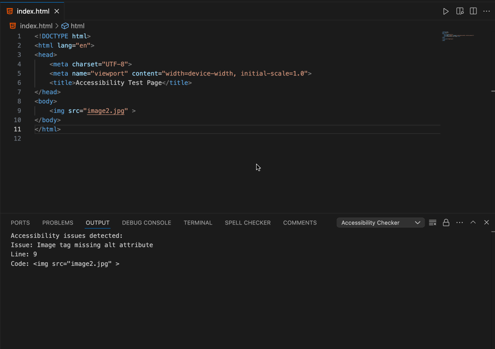

# a11y Checker - VS Code Extension

## Description

The **a11y checker** is a Visual Studio Code extension that helps developers ensure that their HTML and JSX code follows accessibility best practices. The extension scans your code for common accessibility issues, including missing `alt` attributes on images, links without meaningful text, form fields without labels, and other common accessibility violations. It provides immediate feedback within VS Code, allowing you to fix issues directly in the editor.

## Features

- **Accessibility Validation**: Checks HTML and JSX files for accessibility violations such as missing `alt` attributes, buttons without text, and form fields missing labels.
- **Inline Reporting**: Displays accessibility issues with the corresponding line number and code snippet in the output panel.
- **Real-time Feedback**: Run accessibility checks directly from the command palette and see the results instantly.
- **No External Libraries**: The extension does not rely on external libraries for accessibility checks, making it lightweight and easy to maintain.



## Installation

### Prerequisites

- [Visual Studio Code](https://code.visualstudio.com/) version 1.74.0 or later.

### Steps to Install

1. Open **Visual Studio Code**.
2. Go to the **Extensions** view by clicking on the Extensions icon in the Activity Bar on the side of the window.
3. Search for **Accessibility Checker** in the Extensions Marketplace.
4. Click the **Install** button to install the extension.

Alternatively, you can install the extension manually by cloning the repository and running it locally:

```bash
git clone https://github.com/kevinuehara/a11y-checker
cd accessibility-checker
npm install
npm run compile
code .
